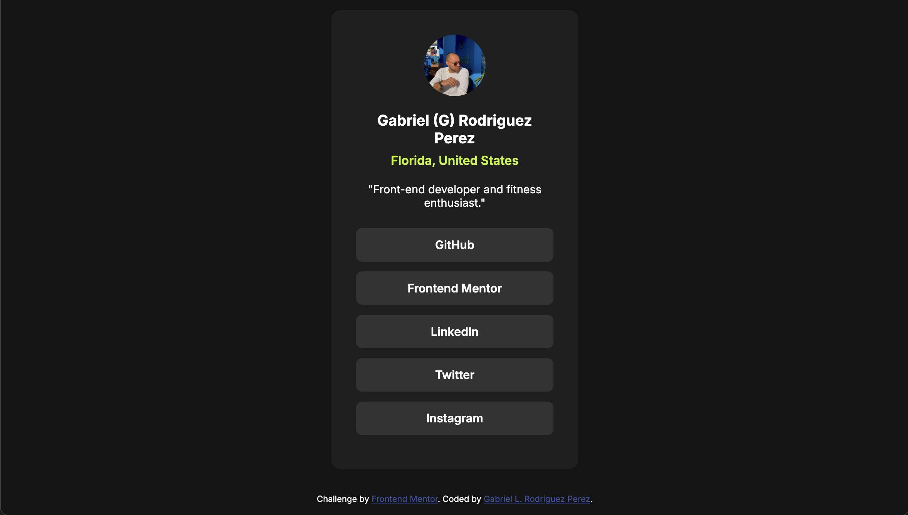

# Frontend Mentor - Social links profile solution

This is my solution to the [Social links profile challenge on Frontend Mentor](https://www.frontendmentor.io/challenges/social-links-profile-UG32l9m6dQ). Frontend Mentor challenges help developers improve their coding skills by building realistic projects with real-world workflows.

## Table of contents

- [Overview](#overview)
  - [The challenge](#the-challenge)
  - [Screenshot](#screenshot)
  - [Links](#links)
- [My process](#my-process)
  - [Built with](#built-with)
  - [What I learned](#what-i-learned)
  - [Continued development](#continued-development)
  - [Useful resources](#useful-resources)
- [Author](#author)

## Overview

### The challenge

Users should be able to:

- View the optimal layout for the site depending on their device’s screen size
- See hover and focus states for all interactive elements on the page

### Screenshot



### Links

- Solution URL: [Social Links Profile Solution](https://github.com/glrodriperez98/social-links-profile)
- Live Site URL: [Social Links Profile Live](https://glrodriperez98.github.io/social-links-profile/)

## My process

### Built with

- Semantic HTML5 markup
- CSS custom properties
- Flexbox
- Mobile-first responsive design
- Google Fonts (Inter)

### What I learned

This project helped reinforce my understanding of writing **semantic HTML**, using **mobile-first CSS**, and organizing code for better readability. I also focused on accessibility and used appropriate tags like `<main>`, `<header>`, `<section>`, and `<footer>` to improve the overall structure. This was feedback provided on my last project and I took extra measures to get it right and use semantic HTML.

Example of semantic HTML usage:

```
html
<main class="card">
  <header>
    
    <h1 class="name">Gabriel (G) Rodriguez Perez</h1>
    <p class="location">Florida, United States</p>
  </header>
</main>
```

### Continued development

I’d like to explore adding:

Light/Dark mode toggle using JavaScript or CSS prefers-color-scheme

Animations for button interactions

More advanced layout strategies using CSS Grid (A focus that I haven't explored but need to now that I'm comfortable with Flexbox)

### Useful resources

Frontend Mentor Slack Community - For feedback and discussion

[***CSS Tricks - Flexbox Guide***](https://css-tricks.com/snippets/css/a-guide-to-flexbox/) - This has been a go to resource for the last 2 projects.

Google Fonts - Used for importing the Inter font

## Author

Gabriel L. Rodriguez Perez

Frontend Mentor - @glrodriperez98

Github - glrodriperez98